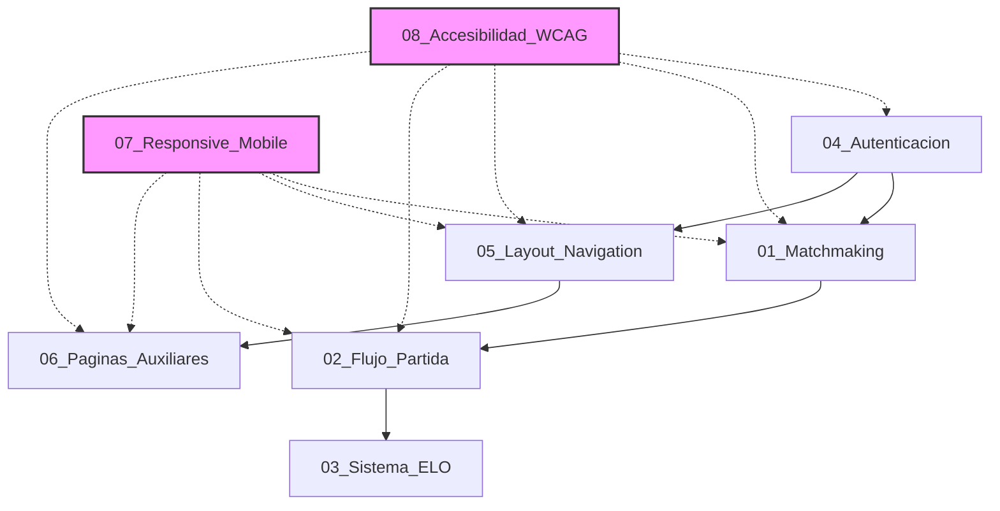

# Especificaciones Funcionales Transversales

Este directorio contiene las especificaciones funcionales de alto nivel que definen sistemas completos de la aplicación. Cada spec describe **qué hace el sistema**, **cómo se usa**, **reglas de negocio**, **casos edge**, y **criterios de aceptación**.

---

## 📋 Índice de Specs

### Core del Juego

#### [01_Sistema_Matchmaking.md](./01_Sistema_Matchmaking.md)
**Sistema de emparejamiento de jugadores en tiempo real.**

- **Algoritmo:** ELO-based con expansión progresiva de rangos (±50 cada 10s)
- **Estados:** Idle → Searching → Found → Starting
- **Timing:** Timeout 60s, expansión cada 10s
- **Cancelación:** Posible en cualquier momento antes de "Starting"

---

#### [02_Flujo_Partida.md](./02_Flujo_Partida.md)
**Mecánica completa de una partida 1v1 desde inicio hasta resultado.**

- **Fases:** Seed → P1 Turn → P2 Turn → Loop → Game Over
- **Validación:** Played together + not used before
- **Timer:** 20 segundos por turno
- **Terminación:** Invalid move, timeout, o disconnect

---

#### [03_Sistema_ELO.md](./03_Sistema_ELO.md)
**Sistema de ranking Elo K-factor 30 con histórico.**

- **Inicio:** 1200 ELO por defecto
- **K-factor:** 30 (rango ±30 puntos por partida)
- **Tracking:** Histórico completo con timestamps
- **Updates:** Tiempo real al finalizar partida

---

### Autenticación y Seguridad

#### [04_Sistema_Autenticacion.md](./04_Sistema_Autenticacion.md)
**Sistema de autenticación multi-provider con NextAuth.js v5.**

- **Providers:** Google OAuth, Discord OAuth, Email/Password
- **Seguridad:** Rate limiting (5 attempts/15min), bcrypt cost 12, JWT tokens
- **Flows:** Register, Login, Logout, Forgot Password, Email Verification
- **Session:** 15min access token, 7 días refresh token

**Componentes derivados:**
- [ ] `LoginForm` (email/password + OAuth buttons)
- [ ] `RegisterForm` (username, email, password validation)
- [ ] `ForgotPasswordForm` (email input + send link)
- [ ] `ResetPasswordForm` (new password + confirm)
- [ ] `OAuthButtons` (Google + Discord)
- [ ] `EmailVerificationBanner` (alert si no verificado)

---

### Layout y Navegación

#### [05_Layout_Navigation.md](./05_Layout_Navigation.md)
**Sistema global de layout: header, footer, navegación responsiva.**

- **Header:** 3 estados (unauthenticated, authenticated, during match)
- **Footer:** Conditional rendering (oculto en partida activa)
- **Mobile Navigation:** Drawer desde la izquierda (<768px)
- **Sticky Header:** con backdrop blur al hacer scroll > 50px

**Componentes derivados:**
- [ ] `Header` (container con 3 estados)
- [ ] `Footer` (4 columnas: logo, links, social, legal)
- [ ] `MobileDrawer` (slide-in navigation)
- [ ] `UserMenu` (dropdown con avatar)
- [ ] `UserAvatar` (imagen o initials fallback)
- [ ] `ELOBadge` (real-time ELO display)

---

### Páginas Auxiliares

#### [06_Paginas_Auxiliares.md](./06_Paginas_Auxiliares.md)
**Landing, error pages, legal pages, contact form.**

- **Landing Page:** Hero + Features + Stats + CTA
- **404 Page:** "Page Not Found" con navegación
- **500 Page:** "Server Error" con error ID tracking
- **How to Play:** Tutorial interactivo con ejemplos
- **Privacy & Terms:** Legal pages con TOC
- **Contact:** Form con rate limiting (3/hora)

**Componentes derivados:**
- [ ] `HeroSection` (landing hero con CTAs)
- [ ] `FeaturesGrid` (4 features con iconos)
- [ ] `StatsCounter` (CountUp animación)
- [ ] `PlayerChainPreview` (scroll automático)
- [ ] `404Page` (error page con glitch effect)
- [ ] `500Page` (error page con tracking ID)
- [ ] `ContactForm` (name, email, topic, message)
- [ ] `HowToPlaySteps` (tutorial interactivo)

---

### Optimización y UX

#### [07_Responsive_Mobile.md](./07_Responsive_Mobile.md)
**Guía de diseño responsivo y optimización móvil.**

- **Breakpoints:** 320px, 640px, 768px, 1024px, 1280px, 1536px
- **Estrategia:** Mobile-first con progressive enhancement
- **Touch Targets:** Mínimo 44x44px (WCAG 2.2)
- **Performance:** Lazy loading, reduced motion, virtualización
- **Offline:** Service Worker + PWA configuration

**Patrones Específicos:**
- Header: hamburger menu en móvil, inline nav en desktop
- Game Board: layout vertical en móvil, horizontal en desktop
- Chain Display: vertical list en móvil, horizontal scroll en desktop
- Modals: full-screen en móvil, centered en desktop

---

#### [08_Accesibilidad_WCAG.md](./08_Accesibilidad_WCAG.md)
**Estándares de accesibilidad WCAG 2.2 AA con implementación.**

- **Navegación:** Tab order, focus management, skip links
- **ARIA:** Live regions para estado del juego, roles correctos
- **Contraste:** 4.5:1 texto normal, 3:1 UI components
- **Keyboard:** Shortcuts (Enter, Esc, Tab, Shift+Tab)
- **Screen Readers:** Anuncios de estado, alt text, labels

**Requerimientos:**
- Lighthouse Accessibility score >= 90
- axe DevTools 0 critical issues
- Navegable 100% con teclado
- Screen reader testing passed (NVDA/VoiceOver)

---

## 🔄 Dependencias entre Specs



**Leyenda:**
- Líneas sólidas: Dependencia técnica (X necesita Y para funcionar)
- Líneas punteadas: Aplicación transversal (guía que aplica a todos)

---

## 📊 Resumen de Reglas de Negocio

### Matchmaking
- Expansión de rango: ±50 ELO cada 10 segundos
- Timeout: 60 segundos máximo
- Cancelable en estados `searching` y `found`

### Partida
- Timer: 20 segundos por turno (warning visual a los 5s)
- Validación: Jugador debe haber jugado con el anterior
- Repetición: Jugador no puede repetirse en la misma partida
- Seed: Aleatorio desde top 100 jugadores del mundo

### ELO
- Inicial: 1200 puntos
- K-factor: 30 (rango de cambio: ±30 puntos máximo)
- Update: Inmediato al terminar partida
- Persistencia: Histórico completo guardado

### Autenticación
- Providers: Google, Discord, Email/Password
- Rate limiting: 5 intentos cada 15 minutos
- Password: Mínimo 8 chars, uppercase, lowercase, number
- Session: 15min access, 7 días refresh

### Layout
- Header sticky: backdrop blur activa al scroll > 50px
- Footer: oculto durante partida activa
- Mobile drawer: cierra automáticamente al navegar

---

## ✅ Checklist de Implementación

### Fase 1: Infraestructura
- [ ] Autenticación (NextAuth.js v5)
- [ ] Layout global (Header, Footer, Navigation)
- [ ] Error pages (404, 500)
- [ ] Landing page
- [ ] Database schema completo

### Fase 2: Core del Juego
- [ ] Matchmaking service
- [ ] PartyKit game rooms
- [ ] Game validation logic
- [ ] ELO calculator

### Fase 3: UI del Juego
- [ ] Game Board
- [ ] Player Autocomplete
- [ ] Game Timer
- [ ] Chain Display
- [ ] Result Modal

### Fase 4: Features Adicionales
- [ ] Leaderboard
- [ ] Profile page
- [ ] Match history
- [ ] Stats dashboard

### Fase 5: Optimización
- [ ] Responsive design en todos los componentes
- [ ] Accessibility audit completo
- [ ] Performance optimization (lazy loading, code splitting)
- [ ] PWA configuration

---

## 📖 Cómo Usar Estas Specs

1. **Backend Architect:** Lee las specs transversales primero, luego las specs de servicios en `../Componentes/Backend/`.
2. **Frontend Architect:** Lee las specs transversales + responsive + accesibilidad, luego las specs de componentes en `../Componentes/Frontend/`.
3. **QA/Testing:** Usa los **Criterios de Aceptación** de cada spec como base para test cases.
4. **Product Owner:** Los **Casos Edge** de cada spec muestran situaciones no obvias que pueden requerir decisiones de negocio.

---

## 🔍 Convenciones de las Specs

Todas las specs transversales siguen esta estructura:

```markdown
# Spec Funcional: [Nombre]

## Descripción
Una o dos frases que expliquen qué es y para qué sirve.

## Flujo principal
Paso a paso del flujo happy path.

## Pantallas / Estados
Wireframes textuales de cada estado.

## Reglas de negocio
RN-XX: [regla] (numeradas para referencia)

## Casos edge
CE-XX: [situación] → [comportamiento esperado]

## Datos necesarios
Schemas, interfaces, endpoints requeridos.

## Criterios de aceptación
- [ ] CA-XX: [criterio verificable]

## Notas para Backend/Frontend Architect
Consideraciones técnicas específicas.
```

---

## 📞 Contacto

Si encuentras ambigüedades, casos edge no cubiertos, o necesitas clarificaciones, documenta tus preguntas y escala al **Orchestrator** para resolución.
